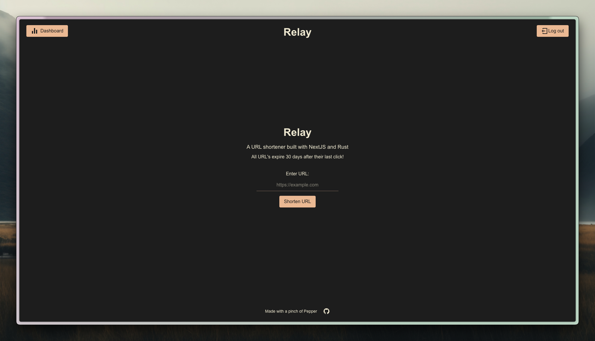

# Relay

A URL shortener built with NextJS and Rust



## Features

- Shortens longer URLs into shorter (not) ones
- Tracks the amount of clicks each URLs have (account required)
- Add custom comments/descriptions/notes to each URL (account required)

Sign in/create an account with:
- Email, password, name
    - Passwords are hashed with [bcrypt](https://crates.io/crates/bcrypt)

## Demo

- Web: [https://relay.pepper.fyi](https://relay.pepper.fyi)

## Self-host

### Requirements

Cloud hosting:
- Docker

Local development:
- pnpm
- cargo
- postgres

### Environment variables

Docker hosting:

```
POSTGRES_USER=
POSTGRES_PASSWORD=
POSTGRES_DB=

PORT=
DATABASE_URL=
SMTP_HOST=
SMTP_PORT=
SMTP_USER=
SMTP_PASSWORD=
JWT_SECRET=

BACKEND_URL=
```

Separate hosting:

Frontend env:
```
BACKEND_URL=
```

Backend env:
```
PORT=
DATABASE_URL=
SMTP_HOST=
SMTP_PORT=
SMTP_USER=
SMTP_PASSWORD=
JWT_SECRET=
```

### Run with Docker

```bash
git clone https://github.com/0x5b62656e5d/relay.git
cd relay
cp .env.example .env

docker compose up
```

### Local development

```bash
git clone https://github.com/0x5b62656e5d/relay.git
cd relay
cp .env.example.frontend ./frontend/.env
cp .env.example.backend ./backend/.env
cp .env.example .env

# backend
cd backend && cargo run

# frontend
pnpm i && pnpm dev
```

## Stack

- Frontend: Next.js
- Backend: Rust (Actix + SeaORM)
- Database: Postgres
- Containerization: Docker

## Privacy Notice

This project only collects user names and email addresses for the purpose of account creation and authentication.

-   Names and emails are **not shared** with third parties.
-   They are **not used** for marketing or unrelated purposes.
-   Users may request deletion of their account (and associated data) at any time.

No other personal information is collected.
